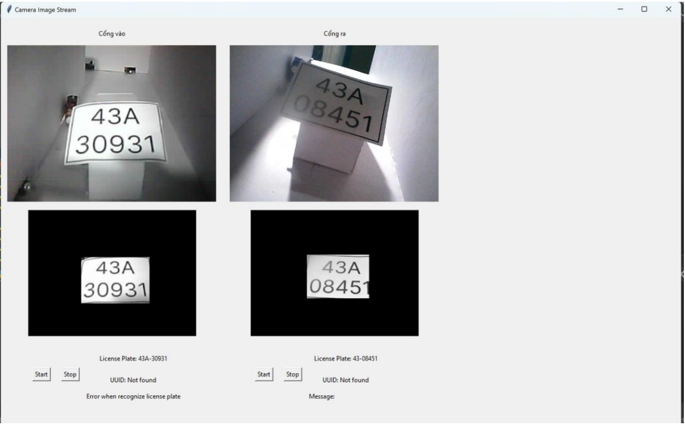

# License-plates detection through Cameras App 
* **Overview**: Giao diện hiển thị hình ảnh nhận được từ Camera tại bãi đỗ xe & xử lý hình ảnh biển số thành chuỗi ký tự.
Ứng dụng được viết bằng Flask App và giao diện thiết kế với Tkinter Lib. Ứng dụng sẽ được chạy trên mô hình thực tế tại máy chủ của người quản lý tại chỗ, nhận được dữ liệu hình ảnh từ Camera tại thời gian thực.
Luồng thực thi: Camera 1 (ESP32 CAM) tại cổng vào gửi về thông qua thư viện requests ip (Phương thức POST)
* Kết quả thực thi chương trình:

* Nguồn tham khảo:
    * Link tham khảo thuật toán nhận dạng biển số xe: https://viblo.asia/p/nhan-dien-bien-so-xe-viet-nam-Do754P9L5M6
